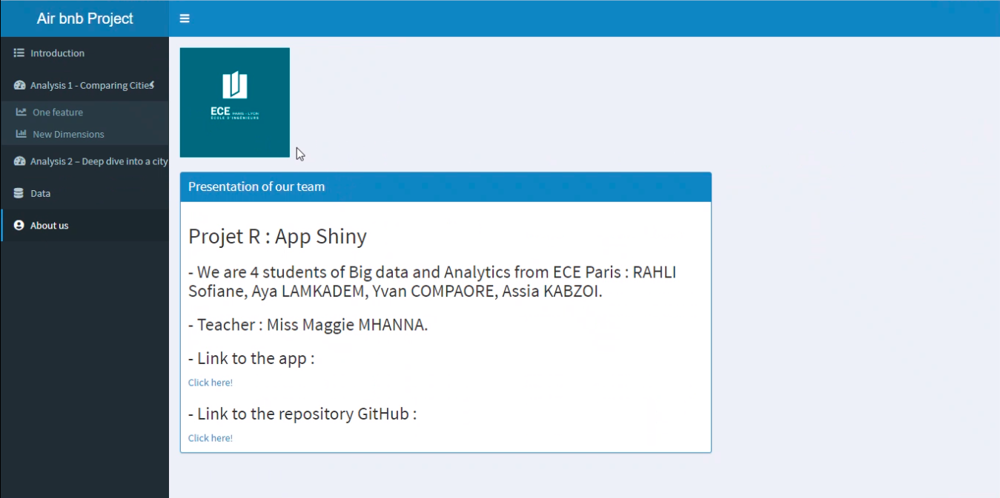

```{r setup, include=FALSE}
knitr::opts_chunk$set(echo = FALSE)
```


## PREPROCESSING DATA

```{r, echo=FALSE}
   
```

## CLEANSED DATA

```{r, echo=FALSE}
   
```


## READ DATA

```{r, echo=FALSE}
   
```

## Architecture of the App 
### Introduction

```{r, echo=FALSE}
   
```

## Architecture of the App
### Analysis 1 

```{r, echo=FALSE}
   
```

## Architecture of the App
### Analysis 1 (More features)
```{r, echo=FALSE}
   
```

## Architecture of the App
### Analysis 2 (Map)

```{r, echo=FALSE}
   
```

## Architecture of the App
### Data page

```{r, echo=FALSE}
   
```


## Architecture of the App
### Abous us

```{r, echo=FALSE}
   
```


